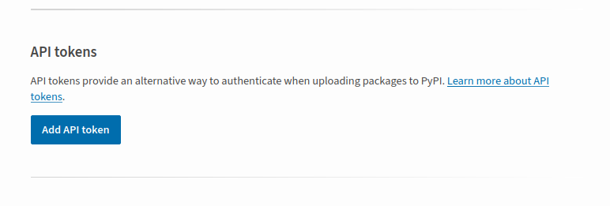
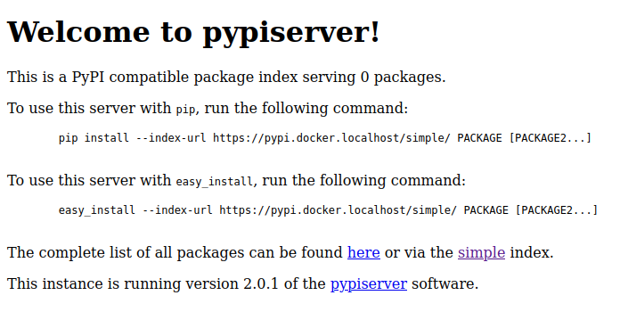
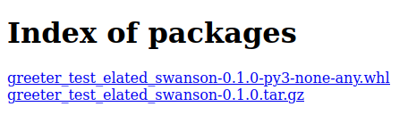

# Part 2: Publishing your package to PyPI

Run `poetry build` (at the level where a valid `pyproject.toml` is present). From this point on, you have two options:

- Publish to pypi
- Publish to a private repository

We will cover both options. But before that, you need to adapt your project so that you can publish it.

!!! info "Set up a private pypi repository"

   You can set up a local pypi server using docker compose. This is recommended for testing purposes.

## Creating the project `greeter`

You will need to create the following files:

```bash
mkdir -p services/part-2
cd services/part-2
mkdir -p src/greeter
touch src/greeter/__init__.py
touch src/greeter/cli.py
touch README.md
touch pyproject.toml
```

Generate a lock file with poetry:

```bash
cd services/part-2
poetry lock
```

The whole project for this part should look like this:

```bash
$ tree services/part-2
services/part-2/
├── poetry.lock
├── pyproject.toml
├── README.md
└── src
    └── greeter
        ├── cli.py
        └── __init__.py

2 directories, 5 files
```

And add the following to the files

```toml
# service/part-2/pyproject.toml
[tool.poetry]
name = "greeter-test-<random_string>"
version = "0.1.0"
description = ""
authors = ["your name <your.name@email.coop>"]
readme = "README.md"
packages = [
    { include = "greeter", from = "src" },
]

[tool.poetry.scripts]
greeter-cli = "greeter.cli:cli"

[tool.poetry.dependencies]
python = "^3.10"
cowsay = "^6.1"

[build-system]
requires = ["poetry-core"]
build-backend = "poetry.core.masonry.api"
```

and finally, update the `README.md` like

```markdown
# Greeter

A dummy wrapper for `cowsay` written for the workshop at <https://github.com/Som-Energia/somenergia-poetry-docker-workshop>.
```

Where `random-string` is some _random string_ we will append to the name of the module so that it wont collide with other pypi libraries.

!!! info "Get random names"

    For the examples from now on, the name of the library will be is `greeter-test-elated_swanson`. You can get a random name [here](https://frightanic.com/goodies_content/docker-names.php). 

Now, from `services/part-2` directory run `poetry build`. This should generate a `dist` directory with a `.tar.gz` file and a `.whl` file.

```bash
$ poetry build
Building greeter-test-ilhUggIkhxjxB (0.1.0)
  - Building sdist
  - Built greeter_test_ilhuggikhxjxb-0.1.0.tar.gz
  - Building wheel
  - Built greeter_test_ilhuggikhxjxb-0.1.0-py3-none-any.whl
```

## Publish to `pypi.org`

!!! info "Set up a pypi account"

    Make sure you have a valid account at [pypi](https://pypi.org/). You can create one [here](https://pypi.org/account/register/).

[Set up `pypi` credentials with `poetry`](https://python-poetry.org/docs/repositories/#configuring-credentials) by [setting a pypi token](https://pypi.org/manage/account/token/)




```bash
poetry config pypi-token.pypi pypi-averylongtoken
```

Now you can just do

```bash
poetry publish
```

!!! warning "Version already exists"

 If you get an error like `HTTPError: 400 Client Error: File already exists. See https://pypi.org/help/#file-name-reuse for url: https://upload.pypi.org/legacy/`, you need to bump the version of your package. You can do this by changing the `version` field in `pyproject.toml` and running `poetry build` again.

## Publish to a private repository

if you wish to publish to a private repository, say, `pypi.docker.localhost`, start it with

```bash
docker compose -f docker-compose.pypi-local.yml up -d
```

from the root of the repository, and then visit <http://pypi.docker.localhost> to see your local pypi server instance. You should see something like this





You can now add repository to the `config` in poetry, from `services/part-2` directory run

```bash
poetry config --local repositories.myprivaterepo https://pypi.docker.localhost/
```

Now your private pypi repository is aliased with `myprivaterepo`

!!! tip "Use `--local`"

    Use `--local` to avoid modifying your global configuration. This will add a `config.toml` file to your `services/part-2` directory.

!!! warning "Don't pass `/simple`"

    Careful to not add the `/simple` bit if your privare repo is using [`pypiserver`](https://hub.docker.com/r/pypiserver/pypiserver), see <https://github.com/pypiserver/pypiserver/issues/329#issuecomment-688883871>

Set up credentials for your private repository with

```bash
# username:password are set at the local pypi server
poetry config http-basic.myprivaterepo username password
```

Since our local pypi server is using a self-signed certificate, we need to disable certificate verification with

```bash
poetry config certificates.myprivaterepo.cert false
``````

And finally, publish your package with

```bash
poetry publish --repository myprivaterepo
```

See <https://python-poetry.org/docs/libraries#publishing-to-pypi> for more documentation. You should see something like this at <https://pypi.docker.localhost/packages/>



## Adding dependencies from private repositories to `pyproject.toml`

You may also want to add dependencies from private repositories. These repos normally need keys to access them. Make sure to follow the instructions from your private repository to add credentials to your `pyproject.toml` file. Generally, the process is as follows:

That means, for example, for any other project that uses poetry, you can add a `source` to its `pyproject.toml` file like

```bash
poetry source add myprivaterepo --priority supplemental https://pypi.docker.localhost
```

This should add something like this

```toml
[[tool.poetry.source]]
name = "myprivaterepo"
url = "https://pypi.docker.localhost"
priority = "supplemental"
```

Add credentials for that repository

```bash
poetry config http-basic.myprivaterepo <user> <password>
```

Now you can add dependencies from `myprivaterepo` using the `--source` argument

```bash
poetry add --source myprivaterepo greeter-test-elated-swanson
```
