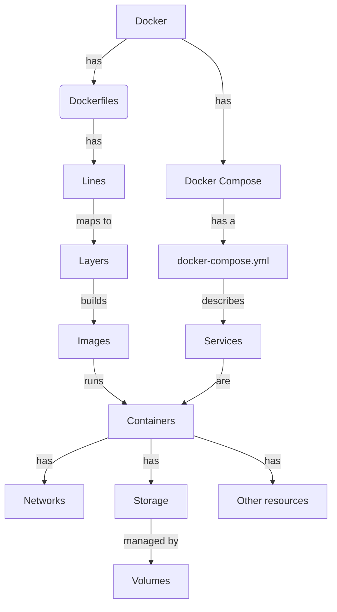
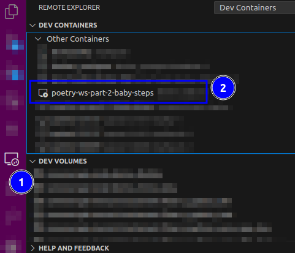
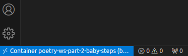

# Part 3: Building your project as a Docker image

Containers are isolated environments that can be used to run applications. You can run a container on any machine that has docker installed. We will cover how to port what we built in [part 1](part-1.md) to a docker container.

!!! warning "This is not a docker workshop"

    We'll see some things about docker but we will not dive into them very much. If you are not familiar with docker, please read the [official documentation](https://docs.docker.com/get-started/). For a thorough introduction to docker, see [this tutorial](https://docker-curriculum.com/) and Jérôme Petazzoni's training materials [here](https://container.training/)

!!! warning "Running docker on Windows"

    Running Docker on Windows has its nuances. Make sure you have administrator rights and you have [Docker Desktop](https://docs.docker.com/desktop/install/windows-install/) installed. You most likely will need [WSL2](https://docs.microsoft.com/en-us/windows/wsl/install-win10) to run docker. You can follow [this tutorial](https://docs.microsoft.com/en-us/windows/wsl/tutorials/wsl-containers) to get started.

## Building a vocabulary around Docker

Docker, `Dockerfile`, `docker-compose.yml`, containers, images, etc. What's that all about? Let's start by defining some terms.

- Docker is the containerization technology. It allows you to run applications in isolated environments called containers. Some other alternatives exist, such as _podman_, _rkt_, _lxc_, _lxd_, etc.
- A `Dockerfile` is a _file_ that contains instructions to build a docker _image_.
- A docker _image_ is a snapshot of a container. It can be used to create _containers_.
- A docker _container_ is a running instance of an image. It can be started, stopped, paused, etc.
- A docker _image_ is built using _layers_, where each _layers_ maps from a line from the `Dockerfile`
- A docker _container_ has network, storage, and other resources allocated to it. It can be configured to expose ports, mount volumes, etc.
- A docker _container_ is designed to be stateless. It can be destroyed and recreated at any time. That means that if you want to persist data, you need to mount volumes to the container.
- _docker compose_ is a docker tool that allows you to define and run _multi-container_ applications. It is configured using a `docker-compose.yml` file.
- a `docker-compose.yml` is a yaml file that describes many services and how they interact with each other. Each service is a container and can be configured to expose ports, mount volumes, etc. Docker compose helps in orchestrating the containers under a _common namespace_.



## Your first container

The most basic container is one that runs a single command. Let's start by creating a `Dockerfile` that runs `echo "Hello world"`.

```dockerfile
FROM ubuntu:latest
RUN apt update && apt install -y cowsay
ENV PATH="/usr/games:${PATH}"
CMD ["cowsay", "somenergia.coop"]
```

Save this file as `services/part-3/baby-steps/Dockerfile`. Let's now build the image. From the root of the repository, run:

```bash
docker build -t poetry-ws-part-3-baby-steps:latest -f services/part-3/baby-steps/Dockerfile .
```

And run it:

```bash
$ docker run --rm poetry-ws-part-3-baby-steps
 _________________
< somenergia.coop >
 -----------------
        \   ^__^
         \  (oo)\_______
            (__)\       )\/\
                ||----w |
                ||     ||
```

What's happening here? Let's break it down:

The `Dockerfile` follows its own syntax:

1. It starts from a base image, in this case `ubuntu:latest`
2. It runs a command, in this case `apt update && apt install -y cowsay`. You can issue as many `RUN` commands as you want. Each one will create a new layer.
3. It sets an environment variable, in this case `PATH`. This is only needed in this case for cowsay to be found. See [more about this here](https://raspberrypi.stackexchange.com/a/1093).
4. We build the image and tag it as `poetry-ws-part-3-baby-steps:latest`. The `-f` flag tells docker to use the `Dockerfile` at the given path.
5. We run the image. The `--rm` flag tells docker to remove the container after it has finished running. The `poetry-ws-part-3-baby-steps` is the name of the image we built. The `CMD` line tells docker to run `cowsay somenergia.coop` when the container starts.

!!! idea "Try it yourself: Talk with a different animal!"

    `cowsay` accepts many arguments. Check `cowsay -l` for a list of available cows. Try to modify the `CMD` line to run `cowsay` with a different _animal_.

    ```
      _______
      < hello >
       -------
      \                             .       .
       \                           / `.   .' "
        \                  .---.  <    > <    >  .---.
         \                 |    \  \ - ~ ~ - /  /    |
               _____          ..-~             ~-..-~
              |     |   \~~~\.'                    `./~~~/
             ---------   \__/                        \__/
            .'  O    \     /               /       \  "
           (_____,    `._.'               |         }  \/~~~/
            `----.          /       }     |        /    \__/
                  `-.      |       /      |       /      `. ,~~|
                      ~-.__|      /_ - ~ ^|      /- _      `..-'
                           |     /        |     /     ~-.     `-. _  _  _
                           |_____|        |_____|         ~ - . _ _ _ _ _>
    ```

    See <https://itsfoss.com/cowsay/> if you need help!

!!! idea "Try it yourself: Have a fortune cowkie"

    `fortune` is another CLI tool that will tell you your fortune when prompted. Try to modify the `Dockerfile` line to run `cowsay` along `fortune`.

    ```
     ____________________________________
    / You will pioneer the first Martian \
    \ colony.                            /
     ------------------------------------
        \   ^__^
         \  (oo)\_______
            (__)\       )\/\
                ||----w |
                ||     ||
    ```

    See <https://itsfoss.com/cowsay/> if you need help!

## Using docker compose

Docker compose allows you to define and run multi-container applications. It is configured using a `docker-compose.yml` file. Let's create one for our `baby-steps` service.

```yaml
version: "3"

services:
  baby-steps:
    image: poetry-ws-part-3-baby-steps:latest
    build: services/part-3/baby-steps
```

Save this file as `docker-compose.part-3.yml`. Let's now build the image. From the root of the repository, run:

```bash
docker compose -f docker-compose.part-3.yml build
```

And run it:

```bash
docker compose -f docker-compose.part-3.yml run baby-steps
```

You should see the same output as before. What's happening here? Let's break it down:

The `docker-compose.yml` follows its own syntax:

1. It defines a `version`. We are using `3` here. See [the documentation](https://docs.docker.com/compose/compose-file/compose-versioning/) for more information.
2. It defines a service, with its own name, `baby-steps`. This services describes the image needed to run this service, and how it can be built from a `Dockerfile`. In this case, we are using the image we built in the previous section.
3. We use docker compose to build the image. The `-f` flag tells docker compose to use a custom `docker-compose.yml` at the given path.
4. We use docker compose to run the image. The `run` command tells docker compose to run the image. The `baby-steps` argument tells docker compose to run the `baby-steps` service.

!!! info "docker compose is not needed to run containers"

    docker compose relies on docker, but it is not needed to run containers. You can run containers using `docker run` as we did in the previous section. However, docker compose is very useful to orchestrate multiple containers together.

## Getting inside a container

You may want to get inside the container to debug something, or to develop applications from inside. We'll see how to do that here.

### Getting inside a running container

You can get inside a running container using `docker run` and replace the command issued at the Dockerfile by something else. Let's try it out. Using plain docker, run:

```bash
$ docker run -it --rm poetry-ws-part-3-baby-steps bash
root@e5e06508458d:/#
```

!!! warning "Running as root"

    You are now running as `root` inside the container. Be careful! This has security implications. See [this guide](https://www.redhat.com/en/blog/understanding-root-inside-and-outside-container) for more information.

Try typing `cowsay something` from inside the container now.

!!! info "Exiting the container"

    You can exit the container by typing `exit` or pressing `Ctrl+D`.

Using docker compose, run:

```bash
docker compose -f docker-compose.part-3.yml run -it --rm baby-steps bash
```

### Using visual studio code to edit files inside a container

You can also use visual studio code to edit files inside a container. This is very useful when you want to develop applications inside a container. You will need the `Remote Explorer` extension. See [this guide](https://code.visualstudio.com/docs/remote/containers) for more information.

!!! info "devcontainers"

    Visual studio has _devcontainers_ feature. See [this guide](https://code.visualstudio.com/docs/remote/containers) for more information. We will not cover this here to keep it simple.

1. Open visual studio code
2. Open the remote explorer and look for the image with the name `poetry-ws-part-3-baby-steps:latest`. Right click on it and select `Attach in current window`.

   

3. Visual studio code will now run from inside the container. You can now edit files and run commands from the terminal. Check the left bottom corner to confirm it!

   

## Building a python image

Let's now build a python image. We'll use the `python:3.9-slim` image as a base. Save this file as `services/part-3/basic-python/Dockerfile`.

```dockerfile
FROM python:3.9-slim
COPY requirements.txt requirements.txt
RUN pip install -r requirements.txt
CMD ["cowsay", "-t", "somenergia.coop"]
```

Add a new service to the `docker-compose.part-3.yml` file:

```yaml
version: "3"

services:
  baby-steps:
    image: poetry-ws-part-3-baby-steps:latest
    build: services/part-3/baby-steps
  basic-python: # new
    image: poetry-ws-part-3-basic-python:latest # new
    build: services/part-3/basic-python # new
```

build the image and run it:

```bash
docker compose -f docker-compose.part-3.yml run  --build basic-python
```

## Recreating project with docker

Let's now recreate part 1 with docker. We'll use the `python:3.9-slim` image as a base. Since this image starts already with python installed, we don't need `pyenv` to install it. But we will create, this time, a virtual environment managed by Poetry.

!!! info "Managing virtual environments inside docker"

    People tend to argue over such scenario. Is isolation within isolation necessary? Is a virtual environment needed inside a docker container? See

      - https://github.com/python-poetry/poetry/discussions/1879#discussioncomment-346113
      - https://github.com/python-poetry/poetry/pull/3209#issuecomment-710678083

    Answer is “it depends”, but it gives more control over dependencies and their state. For this workshop, we recommend it along docker multistage builds.

### Creating the project `greeter`

You will need to create the following files:

```bash
mkdir -p services/part-3/python-poetry
cd services/part-3/python-poetry
mkdir -p src/greeter
touch src/greeter/__init__.py
touch src/greeter/cli.py
touch README.md
touch pyproject.toml
touch Dockerfile
```

Generate a lock file with poetry:

```bash
cd services/part-3/python-poetry
poetry lock
```

The whole project for this part should look like this:

```bash
$ tree services/part-3/python-poetry
services/part-3/python-poetry/
├── Dockerfile
├── poetry.lock
├── pyproject.toml
├── README.md
└── src
    └── greeter
        ├── cli.py
        └── __init__.py

2 directories, 6 files
```

And add the following to the files

```toml
# service/part-3/python-poetry/pyproject.toml
[tool.poetry]
name = "greeter" # new
version = "0.1.0"
description = ""
authors = ["Your Name <you@mail.co>"]
readme = "README.md"
packages = [ #  new
    { include = "greeter", from = "." }, #  new
] #  new

[tool.poetry.scripts]
greeter-cli = "greeter.cli:cli" # new

[tool.poetry.dependencies]
python = "^3.10"
cowsay = "^6.1"

[build-system]
requires = ["poetry-core"]
build-backend = "poetry.core.masonry.api"
```

```python
# service/part-3/python-poetry/src/part_3/cli.py
import cowsay

def cli():
    return cowsay.trex('Greetings from somenergia.coop!') # new

if __name__ == "__main__":
    cli()
```

```python
# service/part-3/python-poetry/src/part_3/__init__.py
```

```markdown
<!-- service/part-3/python-poetry/README.md -->
# Part 3
```
### Creating the Dockerfile

!!! warning "A dense Dockerfile ahead"

    This `Dockerfile` is more involved than the previous ones. We'll break it down in the next sections.

```dockerfile
# service/part-3/python-poetry/Dockerfile
# ---------------------------------------------------------------------------- #
#                            global build arguments                            #
# ---------------------------------------------------------------------------- #

# Global ARG, available to all stages (if renewed)
ARG WORKDIR="/app"

# global username
ARG USERNAME=somenergia
ARG USER_UID=1000
ARG USER_GID=1000

# tag used in all images
ARG PYTHON_VERSION=3.10.9

# ---------------------------------------------------------------------------- #
#                                  build stage                                 #
# ---------------------------------------------------------------------------- #

FROM python:${PYTHON_VERSION}-slim AS builder

# Renew args
ARG WORKDIR
ARG USERNAME
ARG USER_UID
ARG USER_GID

# Poetry version
ARG POETRY_VERSION=1.5.1

# Pipx version
ARG PIPX_VERSION=1.2.0

# prepare the $PATH
ENV PATH=/opt/pipx/bin:${WORKDIR}/.venv/bin:$PATH \
  PIPX_BIN_DIR=/opt/pipx/bin \
  PIPX_HOME=/opt/pipx/home \
  PIPX_VERSION=$PIPX_VERSION \
  POETRY_VERSION=$POETRY_VERSION \
  PYTHONPATH=${WORKDIR} \
  # Don't buffer `stdout`
  PYTHONUNBUFFERED=1 \
  # Don't create `.pyc` files:
  PYTHONDONTWRITEBYTECODE=1 \
  # make poetry create a .venv folder in the project
  POETRY_VIRTUALENVS_IN_PROJECT=true

# ------------------------------ add user ----------------------------- #

RUN groupadd --gid $USER_GID "${USERNAME}" \
  && useradd --uid $USER_UID --gid $USER_GID -m "${USERNAME}"

# -------------------------- add python dependencies ------------------------- #

# Install Pipx using pip
RUN python -m pip install --no-cache-dir --upgrade pip pipx==${PIPX_VERSION}
RUN pipx ensurepath && pipx --version

# Install Poetry using pipx
RUN pipx install --force poetry==${POETRY_VERSION}

# ---------------------------- add code specifics ---------------------------- #

# Copy everything to the container
# we filter out what we don't need using .dockerignore
WORKDIR ${WORKDIR}

# make sure the user owns /app
RUN chown -R ${USER_UID}:${USER_GID} ${WORKDIR}

# Copy only the files needed for installing dependencies
COPY --chown=${USER_UID}:${USER_GID} pyproject.toml poetry.lock README.md src ${WORKDIR}/

RUN poetry install

USER ${USERNAME}

CMD [ "greeter-cli" ]
```

### Breaking down the Dockerfile

There's a lot going on in this `Dockerfile`. Let's break it down.

1. We initialize some global variables meant to be available to all stages. We use the `ARG` keyword to define them.
2. We start by defining the `builder` stage from a _slim_ python image as a base image. We use the `AS` keyword to name the stage.
3. To use the global arguments defined at the beginning, we renew them after a new `FROM` line has been defined. We renew them by simply using the same ARG statement.
4. We define some additional variables such the versions of `poetry` and `pipx` that we want to use. We do this because we want to pin versions for stable builds.
5. We define the `$PATH` variable to control and configure `python`, `poetry` and `pipx` installations beforehand
6. We configure `pipx` installation so that installer uses custom directories.
7. We also add the virtual environment directory to the path so that we can run the project from anywhere.
8. We define the `PYTHONPATH` variable to point to the project directory at `/app` so that we can import modules from the project.
9. We configure poetry using the `POETRY_VIRTUALENVS_IN_PROJECT` variable to make poetry create a `.venv` folder in the project, at `/app/.venv`.
10. We add a user and a group to avoid running as root.
11. We install `pipx` using `pip` and later we install `poetry` using `pipx`.
12. We define our working directory at `/app`. This directory needs to be writable by the user that we created earlier. We also copy the `pyproject.toml` and `poetry.lock` files to the container, along `README.md` and the `src` directory.
13. We seal the stage by switching to the user that we created earlier. From this point on, all commands will be run as this user unless we switch to another user.

Add a new service to the `docker-compose.part-3.yml` file:

```yaml
version: "3"

services:
  baby-steps:
    image: poetry-ws-part-3-baby-steps:latest
    build: services/part-3/baby-steps
  basic-python:
    image: poetry-ws-part-3-basic-python:latest
    build: services/part-3/basic-python
  python-poetry: # new 
    image: poetry-ws-part-3-python-poetry:latest # new
    build: services/part-3/python-poetry # new
```

build the image and run it:

```bash
docker compose -f docker-compose.part-3.yml run  --build python-poetry
```

## Using docker compose to publish the image

!!! info "You will need a docker hub account"

    You will need a docker hub account to publish the image. You can create one [here](https://hub.docker.com/signup). You can then login to your account using `docker login`.

We can use docker compose to publish the image to docker hub. To do this, you must have a docker hub account and be logged in. You can `push` the image to docker hub using:

```bash
docker compose -f docker-compose.part-3.yml push python-poetry
```

!!! warning "Don't put secrets in your Dockerfile"

    You should not put secrets in your `Dockerfile`. Anyone can retrieve a password if you put it at some point in your `Dockerfile`. You should use environment variables or better, use [docker secrets](https://docs.docker.com/engine/swarm/secrets/) to manage secrets. See [this guide](https://pythonspeed.com/articles/build-secrets-docker-compose/) for more information.

